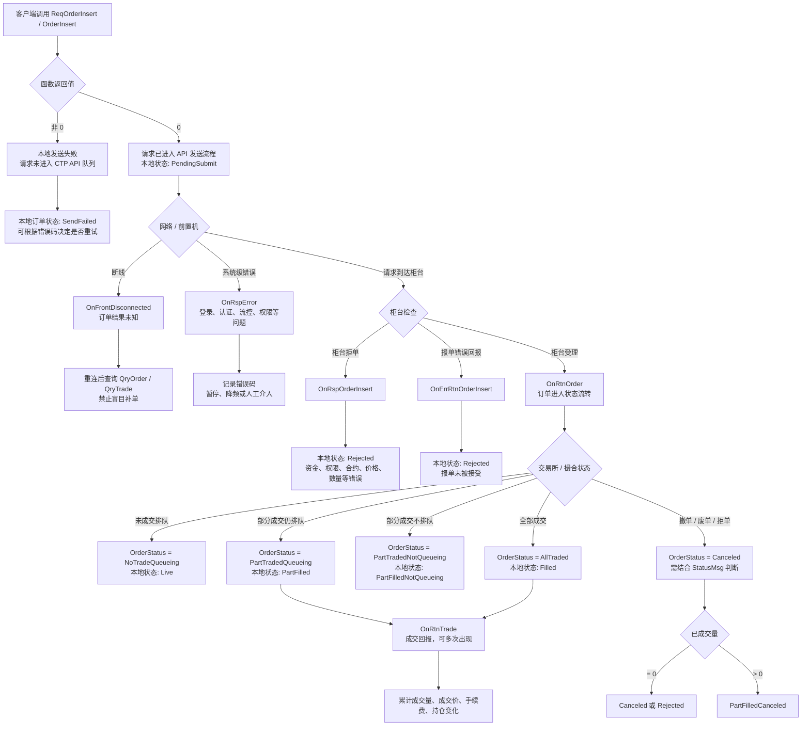
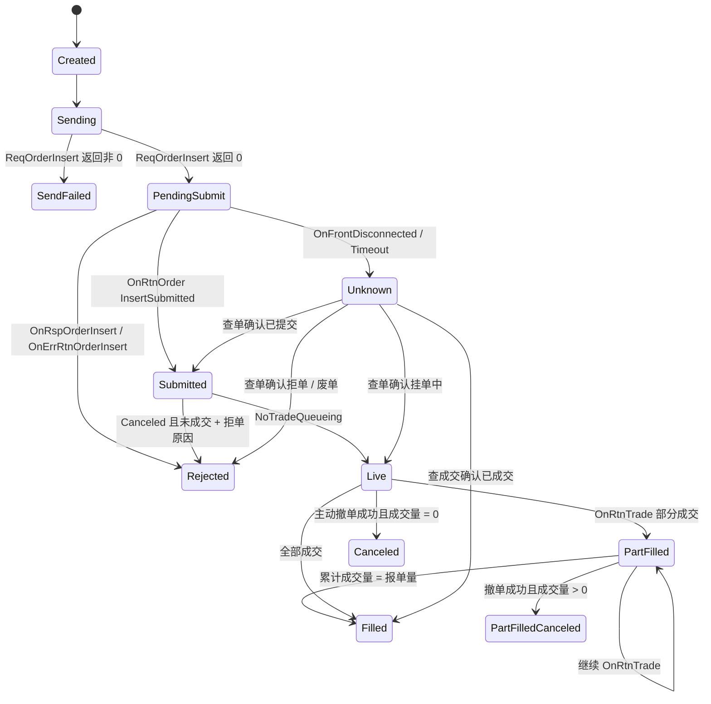

---
tags:
  - CTP
  - 交易系统
  - 期货
  - OrderInsert
  - 状态机
created: 2026-05-25
source: Alma 整理
---

# CTP OrderInsert 全流程与异常处理

> 核心结论：**`ReqOrderInsert / OrderInsert` 返回 `0` 不代表下单成功，只代表请求被 CTP API 接收并进入发送流程。真正的报单结果必须通过回调确认。**

## 总览图



## 关键判断原则

```text
ReqOrderInsert 返回 0
    ≠ 下单成功
    = 请求已发出 / 已进入 API 发送队列

真正结果要看：
    OnRspOrderInsert
    OnErrRtnOrderInsert
    OnRtnOrder
    OnRtnTrade
```

## 可能情况与处理表

| 阶段 | 可能结果 | 典型回调 / 返回 | 含义 | 系统处理建议 |
|---|---|---|---|---|
| 调用 `ReqOrderInsert` | 返回非 `0` | 函数返回值非 0 | 请求没有进入 CTP API 队列 | 标记为 `SendFailed`，可按错误码重试 |
| 调用 `ReqOrderInsert` | 返回 `0` | 函数返回 0 | 只代表请求已发出，不代表下单成功 | 创建本地订单，状态设为 `PendingSubmit` |
| 网络 / 前置机 | 断线 | `OnFrontDisconnected` | 报单结果未知 | 重连后查 `QryOrder` / `QryTrade`，不要盲目补单 |
| 系统级错误 | 请求错误 | `OnRspError` | 登录、认证、流控、权限等问题 | 记录错误码，暂停或降频 |
| 柜台拒单 | 报单响应错误 | `OnRspOrderInsert` | 柜台没接受订单 | 本地订单设为 `Rejected` |
| 报单错误回报 | 错误回报 | `OnErrRtnOrderInsert` | 柜台或交易所前置拒绝 | 本地订单设为 `Rejected` |
| 柜台受理 | 订单回报 | `OnRtnOrder` | 订单进入 CTP 状态机 | 根据 `OrderStatus` 更新 |
| 已提交 | 已提交状态 | `OrderSubmitStatus = InsertSubmitted` | 已提交，等待进一步确认 | 状态设为 `Submitted` |
| 已接受 | 交易所接受 | `OrderSubmitStatus = Accepted` | 交易所接受订单 | 可认为订单有效 |
| 挂单中 | 未成交排队 | `OrderStatus = NoTradeQueueing` | 未成交，仍在队列中 | 状态设为 `Live` |
| 部分成交仍挂单 | 部成排队 | `PartTradedQueueing` + `OnRtnTrade` | 部分成交，剩余继续挂单 | 累计成交量，状态设为 `PartFilled` |
| 部分成交不在队列 | 部成不排队 | `PartTradedNotQueueing` | 部成后剩余不再挂单 | 检查是否撤单、废单或特殊状态 |
| 全部成交 | 全成 | `AllTraded` + `OnRtnTrade` | 完全成交 | 状态设为 `Filled` |
| 撤单 / 废单 / 拒单 | 已撤 | `OrderStatus = Canceled` | 可能是主动撤单，也可能是交易所拒单 | 必须结合 `StatusMsg`、成交量判断 |
| 长时间无回报 | 未知 | 无回调 | 网络、柜台、前置异常 | 标记 `Unknown`，超时后查单 |

## 推荐本地订单状态机



## CTP 回调之间的关系

### `OnRspOrderInsert`

柜台对报单请求的响应。通常表示报单在柜台侧检查未通过，例如：

- 资金不足
- 合约不存在或不可交易
- 没有交易权限
- 价格、数量、开平标志非法
- 投资者、经纪商、交易所参数错误

### `OnErrRtnOrderInsert`

报单错误回报。一般也表示报单失败，但路径可能与 `OnRspOrderInsert` 不完全相同。实盘系统里应统一归入拒单处理链路。

### `OnRtnOrder`

订单状态回报，是订单生命周期的主线。要重点关注：

```cpp
pOrder->OrderStatus
pOrder->OrderSubmitStatus
pOrder->StatusMsg
pOrder->VolumeTotalOriginal
pOrder->VolumeTraded
pOrder->VolumeTotal
pOrder->OrderSysID
pOrder->ExchangeID
```

### `OnRtnTrade`

成交回报。一个订单可能对应多次成交回报，尤其是部分成交场景。

系统中最好将：

- **订单状态**
- **成交明细**
- **累计成交量**

分开维护，不要只依赖单一回调。

## 容易踩坑的点

### 1. `OrderStatus = Canceled` 不一定是主动撤单

CTP 里很多失败最终也会表现为 `Canceled`。

例如：

- 交易所拒单
- 价格超涨跌停
- 合约不可交易
- 报单字段非法
- 风控拒绝

所以不能只看到 `Canceled` 就认为是主动撤单成功，必须结合：

```cpp
pOrder->StatusMsg
pOrder->OrderSubmitStatus
pOrder->VolumeTraded
pOrder->VolumeTotal
```

### 2. 本地订单唯一键建议

下单刚发出时，使用：

```text
FrontID + SessionID + OrderRef
```

拿到交易所订单编号后，再绑定：

```text
ExchangeID + OrderSysID
```

这样可以同时覆盖本地请求阶段和交易所确认阶段。

### 3. 断线期间订单结果是不确定的

断线后没有收到回报，不能直接认为报单失败。

正确流程是：

```text
断线
  ↓
重连
  ↓
重新登录 / 结算确认等必要流程
  ↓
QryOrder 查询委托
  ↓
QryTrade 查询成交
  ↓
修正本地订单状态
```

### 4. 回调顺序不能写死

实盘中可能出现：

- `OnRtnTrade` 早于最终 `OnRtnOrder`
- 多次 `OnRtnOrder`
- 多次 `OnRtnTrade`
- 断线后补发历史状态

所以订单模块应该是**事件驱动状态机**，而不是简单 if-else 流程。

### 5. 发送失败和业务失败要分开

```text
发送失败：
  ReqOrderInsert 返回非 0
  请求没送出去

业务失败：
  ReqOrderInsert 返回 0
  但后续被 OnRspOrderInsert / OnErrRtnOrderInsert / OnRtnOrder 拒绝
```

两者在重试逻辑、风控统计、告警等级上都应该区分。

## 实盘处理建议

1. **所有订单先落本地库**，再发 CTP。
2. `ReqOrderInsert` 返回 0 后，状态只能是 `PendingSubmit`，不能是成功。
3. 所有回调都要按 `OrderRef / OrderSysID` 归并到同一张订单状态表。
4. 超时未回报时，进入 `Unknown`，然后通过查单修正。
5. 对 `Canceled` 状态必须二次判断：主动撤单、交易所拒单、柜台废单要分开。
6. 成交处理以 `OnRtnTrade` 为准，订单最终状态以 `OnRtnOrder` 辅助确认。
7. 日志里必须保留 `StatusMsg`，否则排查拒单原因会很痛苦。

## 简化伪代码

```cpp
int ret = traderApi->ReqOrderInsert(&order, requestId);

if (ret != 0) {
    updateLocalOrder(orderRef, SendFailed, ret);
    return;
}

updateLocalOrder(orderRef, PendingSubmit);

// OnRspOrderInsert
if (pRspInfo && pRspInfo->ErrorID != 0) {
    updateLocalOrder(orderRef, Rejected, pRspInfo->ErrorMsg);
}

// OnErrRtnOrderInsert
updateLocalOrder(orderRef, Rejected, pRspInfo->ErrorMsg);

// OnRtnOrder
switch (pOrder->OrderStatus) {
case THOST_FTDC_OST_NoTradeQueueing:
    updateLocalOrder(orderRef, Live);
    break;
case THOST_FTDC_OST_PartTradedQueueing:
    updateLocalOrder(orderRef, PartFilled);
    break;
case THOST_FTDC_OST_AllTraded:
    updateLocalOrder(orderRef, Filled);
    break;
case THOST_FTDC_OST_Canceled:
    if (pOrder->VolumeTraded > 0) {
        updateLocalOrder(orderRef, PartFilledCanceled, pOrder->StatusMsg);
    } else {
        updateLocalOrder(orderRef, CanceledOrRejected, pOrder->StatusMsg);
    }
    break;
}

// OnRtnTrade
appendTradeDetail(pTrade);
updateFilledVolume(orderRef, pTrade->Volume);
```

## 一句话总结

**CTP 下单不是一次函数调用，而是一个异步状态机。**

`ReqOrderInsert` 只是投递请求，真正的订单生命周期要靠：

- `OnRspOrderInsert`
- `OnErrRtnOrderInsert`
- `OnRtnOrder`
- `OnRtnTrade`
- `QryOrder / QryTrade`

联合判断。
