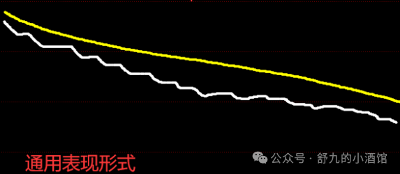

# 交易系统的优先级

对于一个交易系统来说，需要有一个最核心的东西，然后再去把这些操作和理念进行分级。

当出现冲突的时候、混乱的时候，优先执行最高级的那个。

我抛砖引玉吧，如果我的对你有用，你可以借鉴，如果没用，直接划走就行。

在我的交易里，不买不会亏钱，踏空了就等下一个回合，但是死拿是会亏钱的，所以控制回撤优先级是最高的。

因此在我的交易体系里，控制回撤＞跑赢当前平均盈利，这是我交易的优先级。

那么控制回撤基本上就两个手段：

1、止损；

2、仓位；

关于止损

1、卖点：日内弱分时、止损位置。

(1)弱分时出现的时候，要买的计划也不会买，有持仓的时候直接卖；

具体弱分时怎么弱，我有写过，劳烦跳转[小技巧 - 弱分时](https://mp.weixin.qq.com/s?__biz=MzU5MDgzNjA4OA==&mid=2247493407&idx=1&sn=07901511cd9c9fb9453ac447536adb98&scene=21#wechat_redirect)

(2)总仓位净值回撤5%%左右的时候，无脑卖；

无论多么看好，无论逻辑多么天花乱坠，到了就按。

因为我是分仓交易的，且交易的是主动性最强的公司，对于一个带动板块或者全场的核心来说，它是不会有太大的跌幅的，一旦出现了比较大的回撤，就意味着要么票选错了，要么节奏出问题了。

2、仓位

(1)分仓，现在一般334，或者3222，最看好也就4成，但是剩下的仓位不会买别的了。

(2)节点

由于我的体系里，节点是一段行情的起涨点，因此都是节点推仓位，所以离节点越远，仓位越低，离节点越近，仓位越高。

在仓位里，节点＞看好程度。

那么基于这个，当自己出现冲突的时候：

(1)出来一个非常好的业绩，但是市场还在持续下跌

→不做；

(2)出来一个非常好的业绩，且在主线，但是主线在退潮期

→不做

(3)前一天晚上计划第二天要买，但是第二天走出弱分时

→不买；

(4)非常看好且有持仓，但是走势不确定

→打到止损直接止损，弱分时直接卖；

(5)前一天刚买，第二天超预期下跌

→缩量分歧则多拿，如果被打到止损直接止损；

(6)持仓全是利好、逻辑没有问题、权威卖方各种专家大V解读没有问题，但是一直在下跌

→打到止损直接止损；

(7)市场行情非常好，但是一波行情已经涨了比较久且没有出现任何回调迹象

→极度轻仓参与，转折就跑，日内转折次日直接卖；

(8)手上有持仓，第二天极度看好，公开发表看好，但是第二天弱分时

→直接卖；

如上，诸如此类，

控制回撤就是我交易体系里优先级最高的交易，一旦走弱，那么无论当前基本面有多好，一定以控制回撤为主，无论怎么冲突，达到了止损必定止损。

市场很差的时候，没有主线的时候，哪怕出来一个特别好的东西，也不参与。再看好的东西，一路下跌，也绝不拿。

我前期也犯过一些错，就是买的时候回落了、下跌了，券商安慰是交易因素，基本面没有变化、公司不断交流释放积极信息、论坛抱团取暖，但是账户里的钱一点一点在减少，最后等到下决心止损的时候，已经亏很多了。

这也是我性格里厌恶风险的一部分，对于我来说，重新找机会是可以接受的，小亏是可以接受的，但是连续被精神折磨，巨额亏损是不可接受的。

所以我不劝人格局，因为我自己都不格局。

当然有的人是能拿得住，也对亏损承受度是比较高的，我这个对你就没有用了，因为我们不是一个体系的。

最后，

交易系统如同一个精密的机器，应当设置优先级，当运行代码冲突的时候，优先级最高的操作是保护机器能长期运行的保证。

---
原文链接：https://mp.weixin.qq.com/s?__biz=MzU5MDgzNjA4OA%3D%3D&mid=2247494754&idx=1&sn=9253d55614581a2600f1ff20a813eea0&chksm=ff8f80f7f2fef37c72c7173b74f65f13e226c2977c20747f3fabb2558ad339d88b2d14fca957
